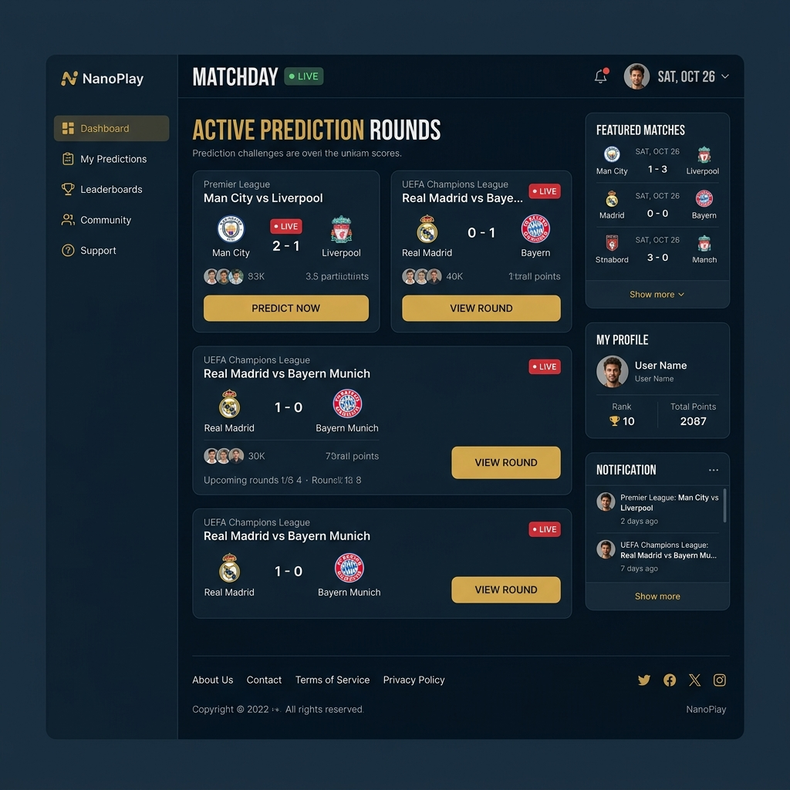
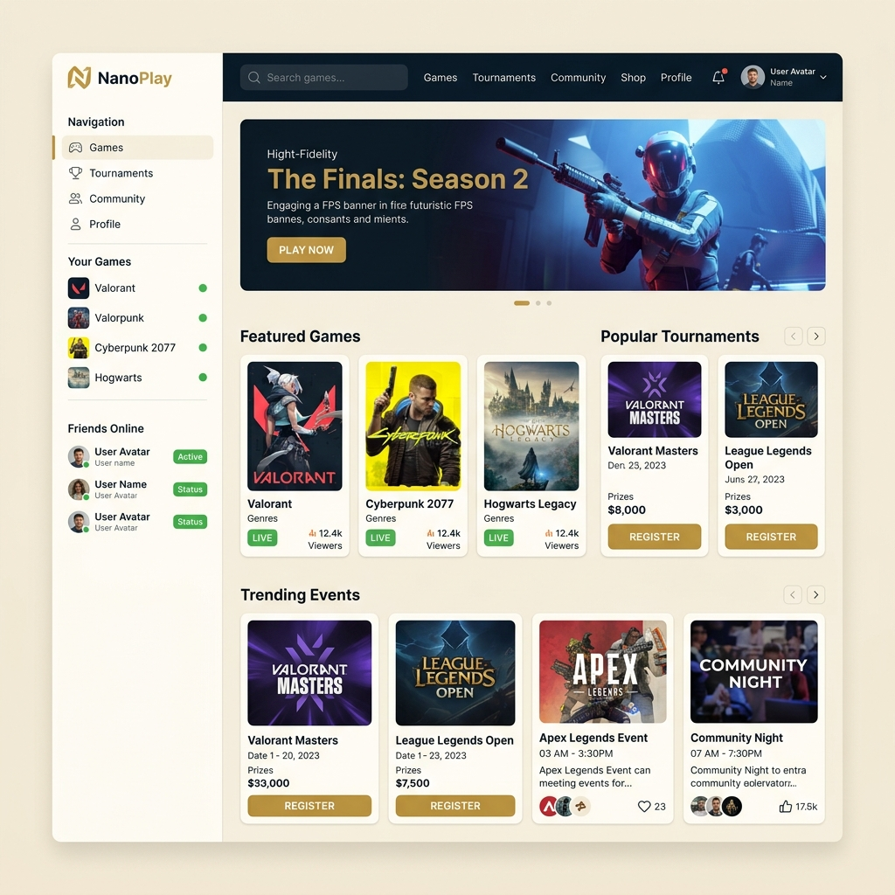
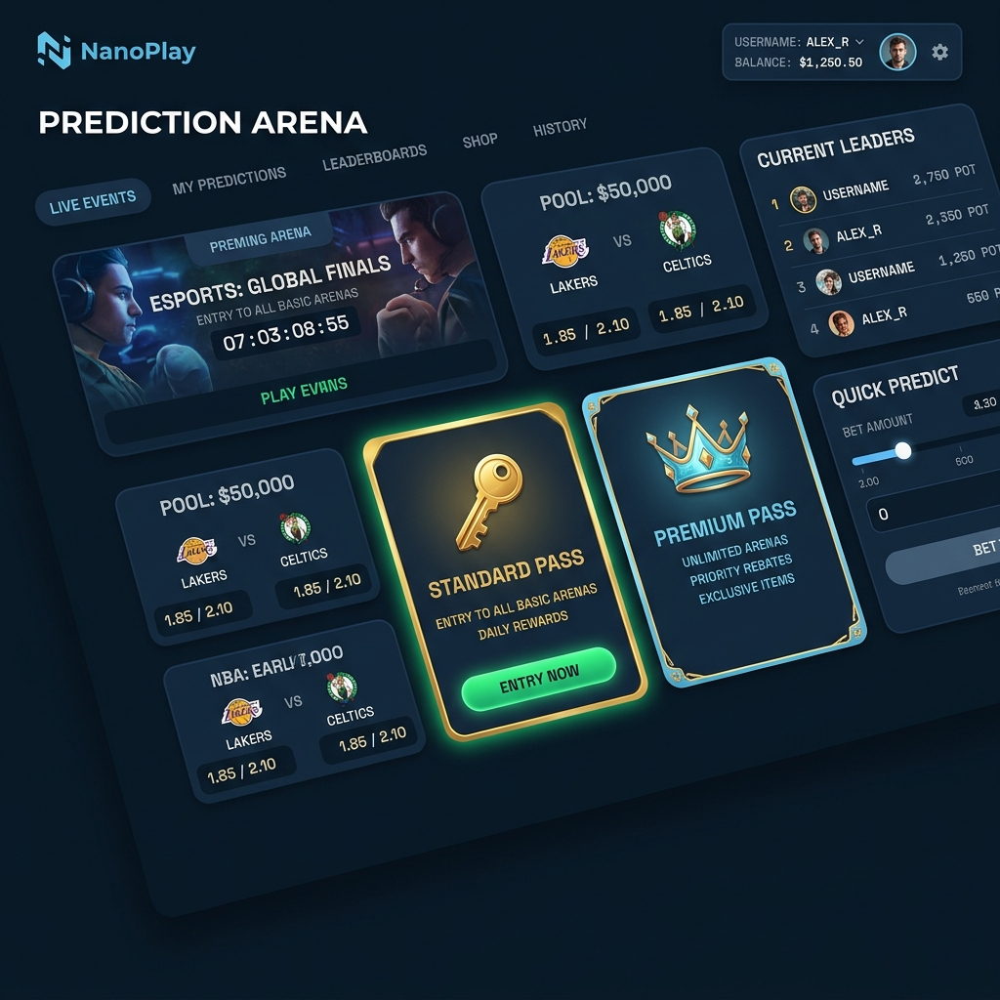
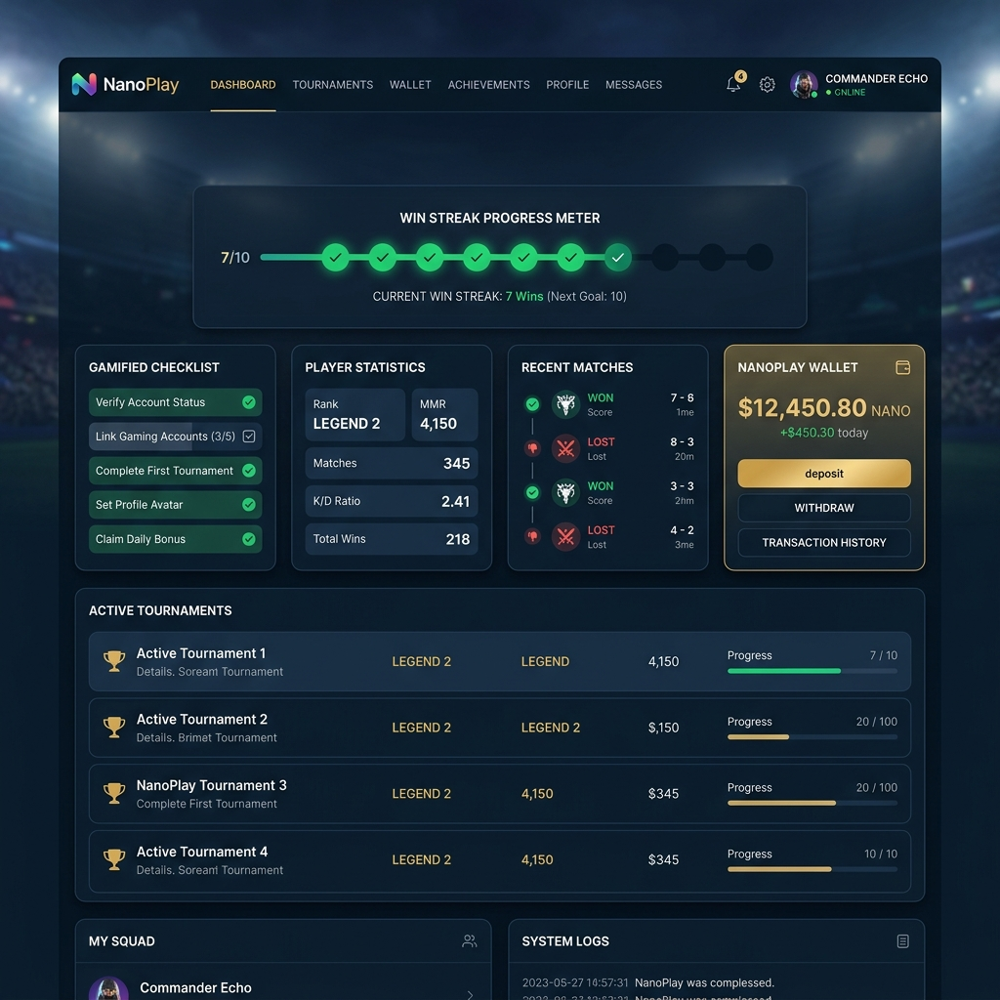
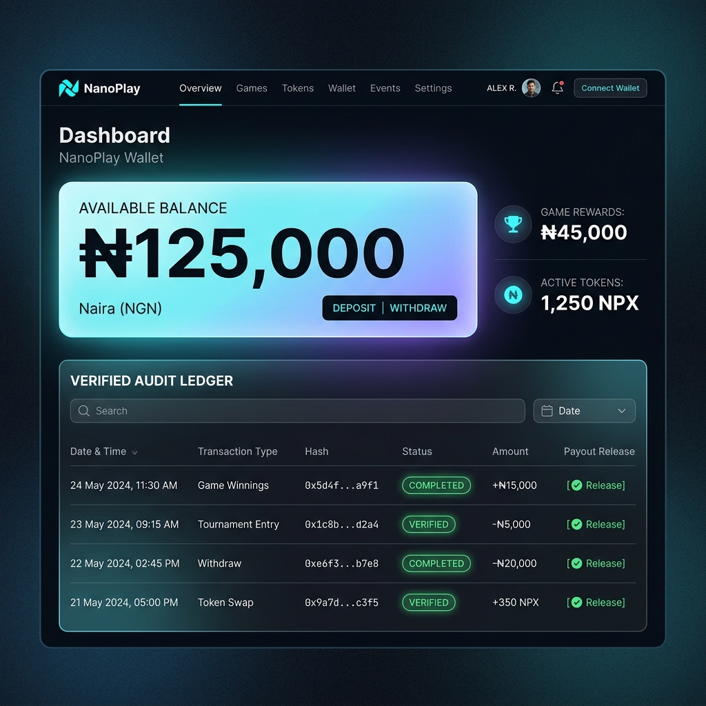
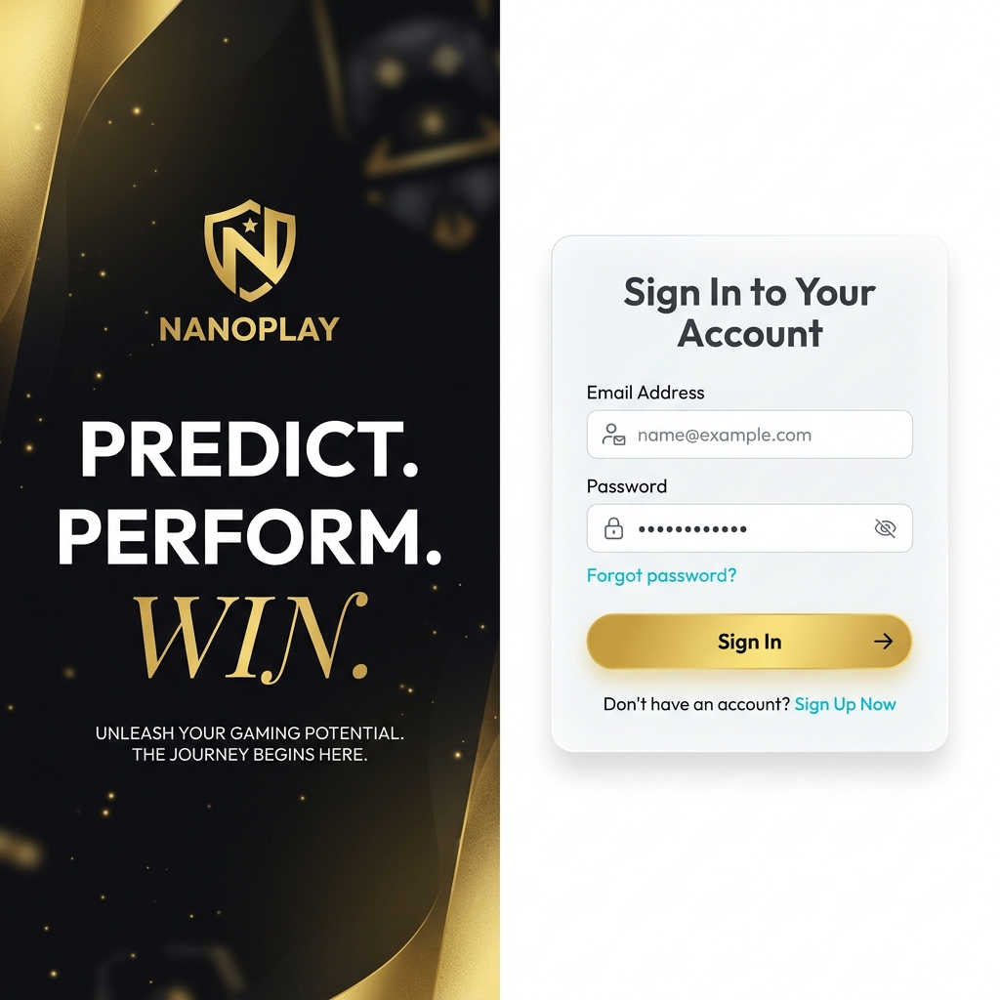
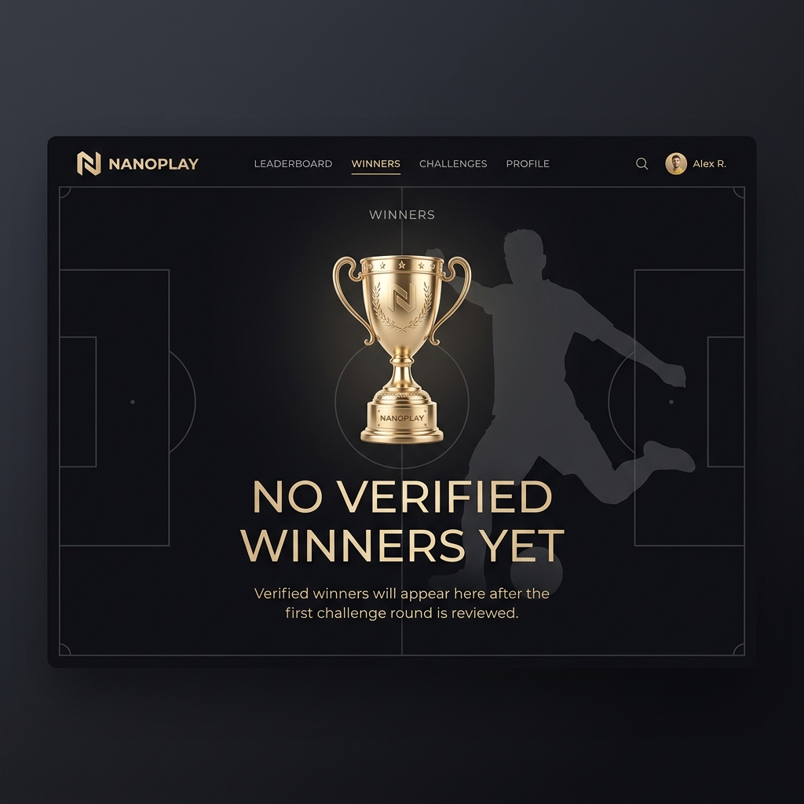

# Walkthrough — NanoPlay Design Overhaul (B127)

I have successfully completed the visual design overhaul based on real mobile user feedback (B127) to refine NanoPlay's sports-tech aesthetic into a premium football challenge arena.

---

## 🎨 Final Brand & Color Direction

*   **Stadium Navy:** default dark mode uses a deep obsidian base (`#050505`) with a pitch-lit stadium navy backdrop and glowing elements.
*   **Stadium Ivory:** light mode uses a soft warm ivory canvas (`#f7f1e5` / `#fffdf7`) with custom radial spotlight gradients.
*   **Victory Gold (`#D6A23A` / `#D4A853`):** Primary brand accent color used for main actions, CTAs, VIP tier badges, active navigation underlines, rewards, and premium highlights.
*   **Premium Live Green (`#12B76A`):** Used strictly for active states (LIVE, ACTIVE, verified, status indicators) and streak progress.
*   **Clean Cyan (`#38bdf8`):** Tech details, support headers, and info boxes (resolved the blue+gold clash by replacing ice-blue `#7dd3fc` with a cleaner cyan).

---

## ✍️ Font System (Reduced to 2 Fonts)

*   **Plus Jakarta Sans:** Primary body copy, layout labels, and headings (Montserrat was dropped to resolve the font clutter).
*   **Space Mono:** Clean, monospaced font for all prediction statistics, time countdowns, and currency numbers.

---

## 🛠️ Redesigned Matchday Card

*   **Betting-Site-Inspired Layout:** Features `1 - X - 2` prediction choices for the featured fixture (Arsenal vs Liverpool).
*   **Permanent Ambient Glow:** The central card gets a 10% gold glow and 30% border opacity to stand out as the primary conversion element.
*   **Streak Progress Indicator:** Green pulse dots (`#12B76A`) represent the user's active streak progress inside the card.
*   **Kickoff Label:** High-contrast label warning: `⚡ PICK BEFORE KICKOFF`.

---

## ✨ Permanent Ambient Glows & Atmosphere

*   **Subtle Glow Ceiling:** Standard glass cards get a subtle permanent ambient glow (3% opacity) instead of a harsh neon glow. Accent cards receive a 5% glow.
*   **Hero Background:** An ultra-lightweight 7KB stadium spotlight WebP image (`stadium-depth-bg.webp`) with CSS gradient masks ensures first-load speeds.
*   **Section Dividers & Labels:** Added gold gradient rules (`.section-divider`) and gold line markers (`.section-label`) to demarcate sections (e.g., `🔴 Live Matchday`, `How NanoPlay Works`, `Challenge Pass`, `Trust & Security`).
*   **Pitch Textures:** Added generic white pitch outline markings at the bottom of homepage sections to reinforce the football arena theme.

---

## 📸 Screenshots

### Dark Homepage - Stadium Navy

### Light Homepage - Stadium Ivory

### Arena Lobby - Stadium Navy

### Dashboard - Stadium Navy

### Wallet & Transaction Ledger - Stadium Navy

### Split Screen Login - Stadium Navy

### Winners Podium & Empty State - Stadium Navy

---

## ✅ Compilation & Status

*   **Production Build:** Successfully built with Next.js Turbopack compiler.
*   **TypeScript & Linter Checks:** Passed cleanly with zero exceptions.
*   **Vercel Live URL:** [https://nanoplay-26w993m8e-olabodesamuel0920-maxs-projects.vercel.app](https://nanoplay-26w993m8e-olabodesamuel0920-maxs-projects.vercel.app)
